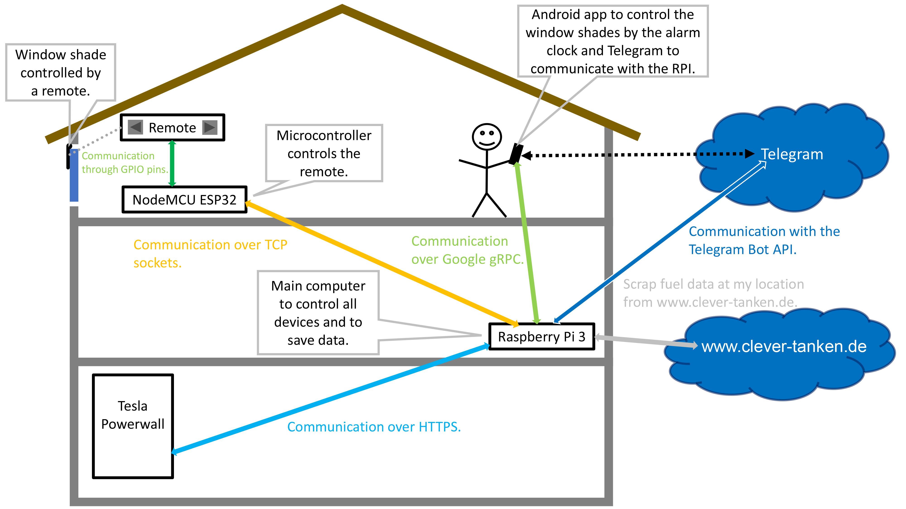
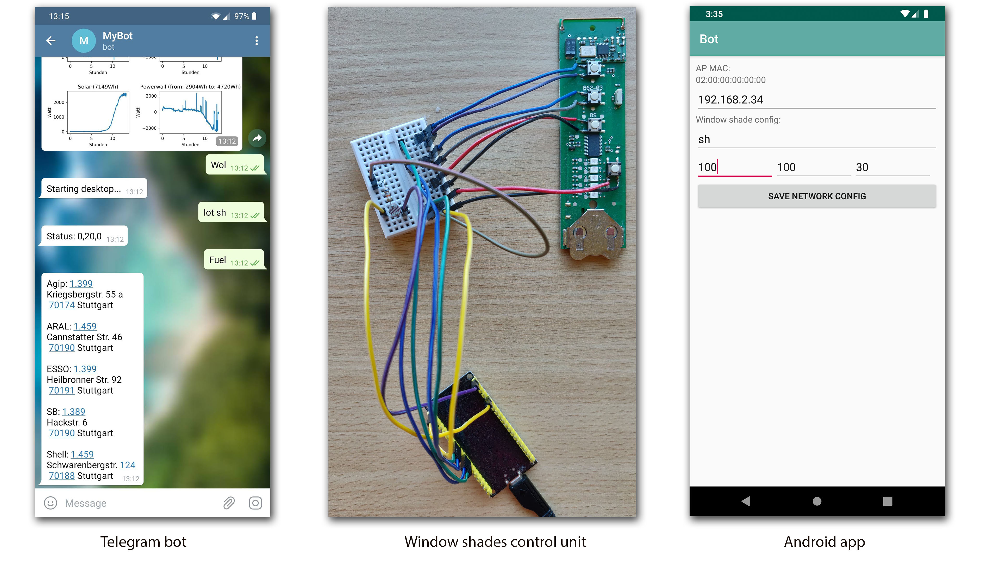

# Project description

This project is a bot which collects data and controls systems in your home. Currently the bot saves
power values from a Tesla Powerwall, scraps a website for fuel
prices at my location, can start my desktop pc and controls
my window shades. It has several user interfaces
like an Android app, a website and a Telegram Bot. In the following
graphic you can see how the devices interact with each other:

This project is written in Python, C++, Kotlin, PHP and HTML and uses
libraries like Google Protobuf, Google gRPC, Scipy, Telepot, Matplotlib and Pandas.
I develop it besides my studies in my free time and the system
is running flawlessly on a Raspberry Pi 3 Model B since the beginning of 2019.

## Overview

- **Android app** (folder: [android_app](android_app)): The app listens to the Android Broadcast 
"NEXT_ALARM_CLOCK_CHANGED" which is sent if a new alarm is set. 
Then the app tells the RPI via gRPC when the alarm is triggered. 
15 minutes before the alarm is triggered the RPI will open the window 
shades a little bit. After the alarm when the smartphone locks into 
the wifi network the RPI opens the window shades completely. 
Additionally the app provides a Android Widget to move the window 
shades completely up or down manually.

- **IOT devices** (folder: [iot_devices](iot_devices/ControlShade/ControlShade.ino)): This folder contains the Arduino
program for the NodeMCU ESP32 microcontroller to control the buttons 
of the window shades remote via transistors. The RPI can
either ask the microcontroller in which state it is or it sets a new
state via messages sent over TCP. Furthermore the microcontroller
has a light detector on an analog input to move the window
shades down when it gets dark outside.

- **Main program** (folder: [main](main)): This is the main program which
runs on the Raspberry Pi and communicates with all the devices like
the microcontroller for the window shades, the Tesla Powerwall,
the Android app and Telegram. It also saves the collected data
and draws graphs of it.

- **Webinterface** (folder: [website](main/website)): Currently the website only
shows the power values from the Powerwall for every day and every
month as well as the graphs for the current day. Furthermore
you can download csv files with the values from every day and
every month.

# Pictures

# Acknowledgement

I want to thank my brother Benjamin Hauck who figured out how to control the buttons
of the window shades remote via transistors and who helped me to assemble the
window shades control unit.

# License

The source code of this project is licensed under the GNU GPLv3 except for
the [Base64.h](main/fuelprice/webscraper/src/Base64.h) file (Copyright (c) 2016 tomykaira) which is
licensed under the MIT license. For further information see the [LICENSE](LICENSE) file.
